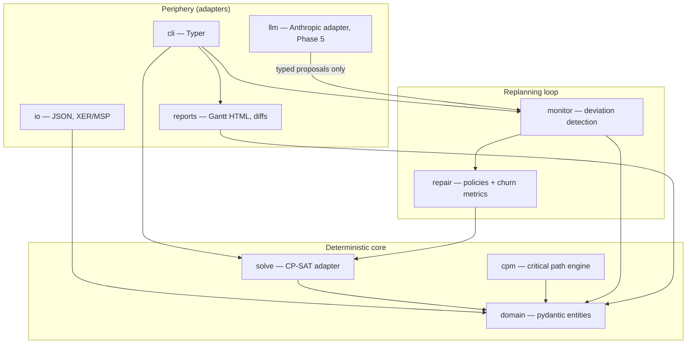
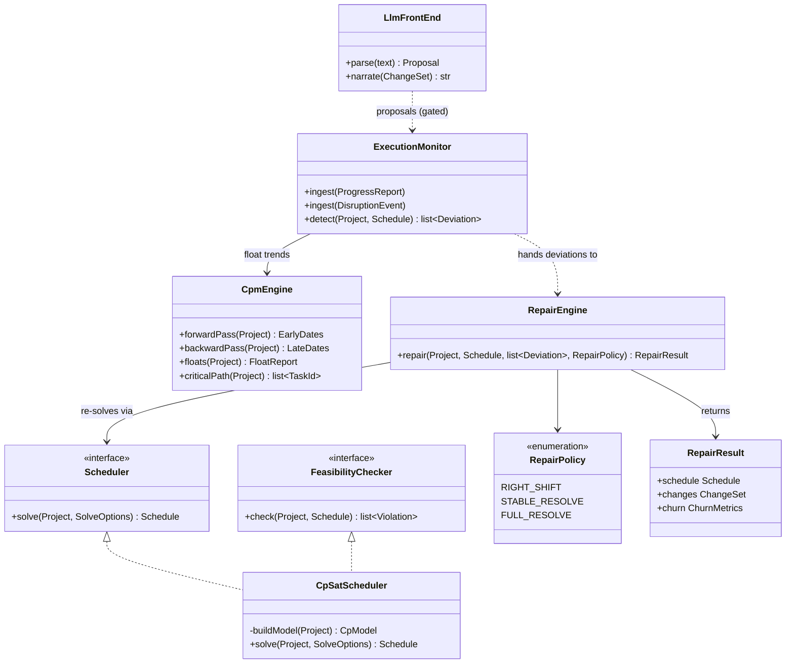

# 02 — Architecture

## Shape of the system

planREplan is a layered system with a deterministic symbolic core and optional intelligent periphery. Dependencies point strictly inward: the periphery knows the core; the core knows nothing of the periphery.

The load-bearing boundaries:

1. **Solver isolation.** Only `solve/` imports `ortools`. It exposes `Scheduler` (build model → solve → extract `Schedule`) and `FeasibilityChecker` (validate a schedule or proposal against constraints). Everything else works with domain objects. This keeps the domain testable without OR-Tools, and keeps the seam open for an alternative backend (e.g., a PDDL/unified-planning adapter) without touching callers.
2. **The proposal gate.** `llm/` can only emit typed proposal objects (`ProgressReport`, `DisruptionEvent`, `ScopeChange` drafts). These pass through domain validation, then `FeasibilityChecker`, before the monitor treats them as facts. The LLM-Modulo pattern as a type system.
3. **Immutable schedules.** `Schedule` values are frozen; `repair/` returns `(new_schedule, change_set, churn_metrics)`. History is a sequence of schedules linked by ChangeSets — an audit trail by construction.

## Class-level view

Notes for implementers: `CpmEngine` is pure functions over the domain — no classes needed beyond a namespace if that's cleaner in Python. `ExecutionMonitor` consults CPM float trends to flag *deadline jeopardy* before anything is formally late; this is the cheap early-warning path that doesn't require a solver call. `RepairEngine` is where the stability/optimality tradeoff lives — see `04-replanning-design.md` for the policy semantics and the objective function of `STABLE_RESOLVE`.

## Interfaces and phasing

Phase 1–4 expose everything through the CLI (`planreplan solve`, `status`, `repair`, `report`) operating on a project directory (SQLite db + JSON import/export). A FastAPI service wrapping the same core is a Phase 5+ concern and must not leak into core design. Reports are self-contained HTML files (inline SVG Gantt, before/after repair views) so they can be attached to emails and embedded in educational docs without a server.
