# 03 — Domain model

The domain model is the ubiquitous language of the system. Names below are normative — code, docs, and conversation use these words with these meanings.

## Core entities

```mermaid
classDiagram
  direction TB
  class Project {
    +id
    +name
    +axis TimeAxis
    +calendar Calendar
    +payRules PayRules
    +tasks list~Task~
    +resources list~Resource~
    +baselines list~Baseline~
  }
  class Task {
    +id
    +wbsPath
    +name
    +duration int
    +calendarId
    +parentId
    +isMilestone bool
    +deadline int
    +hardCommitment bool
    +status TaskStatus
  }
  class Dependency {
    +predecessorId
    +successorId
    +kind DependencyKind
    +lag int
  }
  class DependencyKind {
    <<enumeration>>
    FS
    SS
    FF
    SF
  }
  class Resource {
    +id
    +name
    +capacity int
    +calendarId
    +payRulesId
    +exceptions list~CalendarException~
  }
  class Assignment {
    +taskId
    +resourceId
    +demand int
  }
  class TimeAxis {
    +epoch datetime
    +ticksPerDay int
    +toDatetime(tick) datetime
    +toTick(datetime) int
    +toTickExact(datetime) int
  }
  class Calendar {
    +id
    +name
    +weekPattern map~DayOfWeek,Shifts~
    +exceptions list~CalendarException~
    +shiftsOn(date) Shifts
  }
  class CalendarIndex {
    +horizon int
    +blocks list~WorkBlock~
    +totalWork int
    +isWorking(tick) bool
    +workingPrefix(tick) int
    +tickAtWorkIndex(workIndex) int
    +nextWorkingTick(tick) int
    +span(startTick, duration) int
    +finish(startTick, duration) int
    +intersect(CalendarIndex) CalendarIndex
  }
  class WorkBlock {
    +start int
    +end int
    +workBefore int
  }
  class Shift {
    +name
    +startMinute int
    +endMinute int
  }
  class CalendarException {
    +window Window
    +working bool
    +shifts Shifts
    +reason
  }
  class PayRules {
    +id
    +weekStartsOn DayOfWeek
    +dailyRegularHours int
    +weeklyRegularHours int
    +dayPremiums map~DayOfWeek,float~
    +shiftPremiums map~ShiftName,float~
    +holidayPremium float
    +classify(tick, hoursInDay, hoursInWeek) PayClass
  }
  class OvertimeReport {
    +resourceId
    +weekStart int
    +regularHours int
    +premiumHours map~PayClass,int~
  }
  class Schedule {
    <<immutable>>
    +id
    +dataDate int
    +projectFinish int
    +entries map~TaskId,ScheduleEntry~
    +solverInfo
  }
  class ScheduleEntry {
    +taskId
    +start int
    +finish int
    +resumeAt int
    +state EntryState
  }
  class EntryState {
    <<enumeration>>
    PLANNED
    IN_PROGRESS
    COMPLETE
  }
  class Baseline {
    +name
    +frozenAt
    +schedule Schedule
  }
  class ProgressReport {
    +taskId
    +percentComplete
    +actualStart int
    +actualFinish int
    +remainingDuration int
  }
  class DisruptionEvent {
    +kind DisruptionKind
    +payload
    +effectiveAt int
  }
  class Deviation {
    +kind DeviationKind
    +taskIds
    +severity Severity
    +evidence
  }
  class Severity {
    +band SeverityBand
    +magnitude float
  }
  class SeverityBand {
    <<enumeration>>
    EROSION
    BREACH
    INVALID
  }
  class ChangeSet {
    +fromScheduleId
    +toScheduleId
    +moves list~TaskMove~
    +added list~TaskId~
    +removed list~TaskId~
    +durationChanges list~DurationChange~
  }
  class TaskMove {
    +taskId
    +deltaStart int
    +deltaFinish int
  }
  class DurationChange {
    +taskId
    +fromDuration int
    +toDuration int
  }
  Project "1" *-- "many" Task
  Project "1" *-- "many" Resource
  Project "1" *-- "many" Dependency
  Project "1" *-- "1" TimeAxis
  Project "1" *-- "many" Calendar
  CalendarIndex ..> Calendar : materialises
  CalendarIndex --> TimeAxis
  CalendarIndex "1" *-- "many" WorkBlock
  Project "1" *-- "many" PayRules
  Project "1" o-- "many" Baseline
  Calendar "1" *-- "many" Shift
  Calendar "1" *-- "many" CalendarException
  Task --> Calendar : declared
  Resource --> Calendar : base
  Resource --> PayRules
  Task "1" -- "many" Assignment
  Resource "1" -- "many" Assignment
  Task --> Task : parentId (WBS)
  Schedule ..> Project : schedules
  Baseline *-- Schedule
  Schedule "1" *-- "many" ScheduleEntry
  ScheduleEntry --> EntryState
  ChangeSet *-- TaskMove
  ChangeSet *-- DurationChange
  Deviation --> Severity
  Severity --> SeverityBand
  ChangeSet ..> Schedule : diffs two
  OvertimeReport ..> Resource : per resource-week
```

## Time, calendars, and the tick axis

Time is a **uniform integer tick axis** measured from the project `epoch`, with no gaps and no compression. Every tick exists whether or not anyone is working. `Project.ticksPerDay` declares the resolution — 24 (hourly, the default), 8 (shift), 1 (daily), or finer such as 96 (quarter-hour). Precedence, resource constraints, deadlines, actuals, and schedule starts are all expressed on this one axis, so any two entities are directly comparable regardless of which calendar governs them. See ADR-8 in `05-technology-decisions.md` for why the axis is not a per-calendar working-time index.

`Calendar` is a **predicate over the axis**, never the axis itself, and it separates into three types. `TimeAxis` owns the origin and resolution and performs every conversion between wall-clock time and ticks. `Calendar` is pure data: `weekPattern` maps each day of the week to shift windows in local wall-clock time, and `CalendarException` overrides a window (a holiday, a weather shutdown, an equipment breakdown, an inspector's absence — all the same mechanism), with the last matching exception winning so a narrow override can follow a broad one. `CalendarIndex` materialises a `Calendar` against a `TimeAxis` and answers the questions the solver and monitor actually ask: `isWorking`, `workingPrefix`, `span`, `intersect`.

The split matters because a `Calendar` cannot answer `isWorking(tick)` alone — it needs the axis to know what a tick is — and because intersection is exact and cheap on materialised blocks but awkward on two sets of week patterns and exceptions. It is the same separation `02-architecture.md` draws between domain-owned predicates and solver-owned tables, one level down.

A `CalendarIndex` stores **sorted runs of working ticks** (`WorkBlock`), each tagged with the work preceding it, rather than a dense per-tick array. Within a block the prefix function W is affine, so a binary search answers `workingPrefix` in O(log n). A five-day eight-hour calendar over three years is roughly 780 blocks against 26,000 ticks; the representation is closed under intersection, which matters because effective calendars are intersections and there may be one per distinct resource mix; and the linear walk that builds the ADR-8 solver table is a walk over blocks. The cost is O(log n) lookup rather than O(1), which is negligible beside model construction. The index is built eagerly to an explicit horizon and refuses queries beyond it, because silently reporting non-working time past the end would be indistinguishable from a project that stops in mid-air.

Shift boundaries are stored as **minutes from local midnight**, because construction start times are routinely half-past — a 06:30 start is ordinary. Whether a boundary is *usable* depends on the axis: 06:30 requires `ticksPerDay >= 48`, and building the index refuses a misaligned boundary rather than rounding it, naming the resolution that would fit.

`epoch` is timezone-aware, ticks are absolute, and boundaries are converted per local day, which is what absorbs daylight saving. A wall-clock eight-hour shift is seven working ticks on a spring-forward day and nine on a fall-back day, because that is how long the crew is physically on site. No other component performs datetime arithmetic.

`Task.duration` is an integer count of **working ticks** — work content, not elapsed span. The span a task occupies on the axis is derived and start-dependent: `span = duration + non-working ticks straddled`. A 24-hour task starting Friday at 08:00 occupies 24 ticks on a seven-day round-the-clock calendar and 104 on a five-day eight-hour one; an 8-hour task starting Friday at 13:00 occupies 8 ticks on the former and 72 on the latter. Those figures are pinned as tests in `tests/test_calendar.py`. The io and CLI layers may accept durations written as days (`3d`) and convert using the governing calendar's nominal day length, but hours are canonical — otherwise editing a calendar would silently redefine every duration in the project.

A task's **effective calendar** is its declared calendar intersected with the effective calendars of all assigned resources; a resource's effective calendar is its base calendar with its own `exceptions` layered on top. This gives "governing calendar" a precise definition: work happens only when the task's calendar and every assigned resource agree. An empty intersection is a validation error, not an infeasible solve.

`Task.hardCommitment` marks work that genuinely cannot move — a crane on a booked date, a pour whose concrete delivery is fixed. It pins the task at its start in the active schedule and is distinct from the commitment horizon, which protects near-term work softly and by degree. Hard commitments are the first rung of the relaxation ladder in `04-replanning-design.md`: they can be broken when they conflict, but never silently. Storing the flag on `Task` rather than per schedule is a v1 simplification — a commitment is really made against a particular plan.

`Dependency.lag` is measured in **elapsed** ticks, not working ticks. Construction's pervasive SS+lag links are mostly cure, dry, and settle times, which run on wall-clock time rather than crew time. Because a successor's start must still land on a working tick, an elapsed lag that expires mid-weekend simply resolves forward to the next working tick. Per-dependency lag calendars are a v2 candidate.

## Structure and resources

Tasks form a WBS tree via `parentId`; only leaf tasks carry durations, assignments, and schedule dates — summary tasks derive their spans from children (HTN-style: summaries are decomposable tasks, leaves are primitive). `wbsPath` (e.g. `1.3.2`) is display metadata derived from the tree, never an identity.

Dependencies connect leaf tasks (v1; summary-level dependencies are expanded to leaves at validation time). All four kinds are supported from the start because construction schedules use SS+lag pervasively.

Resources are renewable with integer capacity per tick (a crew of 4, 2 cranes). An `Assignment` demands integer units for the task's full duration (v1 simplification; time-varying demand is out of scope). **A resource is reserved across the task's entire span, including internal non-working gaps.** A task running from Friday afternoon into Monday morning holds its crew through the intervening idle ticks. This is deliberate rather than a limitation — crews are not released to another foreman mid-pour — and it only becomes visible when resources on differing calendars share one task, which validation warns about.

## Overtime

`PayRules` expresses a labor agreement and attaches to `Resource`, defaulting to the project-level rule set. It is not part of `Calendar`: two crews working identical hours can be paid under different agreements, and that is the common case on a multi-trade site.

Three independent premium sources are represented: **daily** hours beyond `dailyRegularHours`, **weekly** hours beyond `weeklyRegularHours` within a pay week starting on `weekStartsOn`, and **positional** premiums from `dayPremiums`, `shiftPremiums`, and `holidayPremium`. They are independent by construction because real agreements treat them independently — a Saturday carries its premium regardless of whether the week reached forty hours, and a compressed 4×10 week reaches forty hours without necessarily incurring daily overtime. Whether a given agreement exempts 4×10 from daily overtime is data in `PayRules`, never a hardcoded threshold.

Weekly overtime is a property of a **resource across all its tasks**, not of any single task: a crew crosses forty hours from the combination of its assignments. Overtime is therefore computed as an aggregation over a whole schedule, `overtime_report(project, schedule) -> list[OvertimeReport]`, and never stored on a task.

In v1 overtime is **represented and reported, not optimized**. Cost objectives remain a later-phase concern (see `06-roadmap.md`); when they arrive, minimizing premium hours becomes an additional term in the `STABLE_RESOLVE` objective without a schema change.

## Schedules, progress, and deviations

`Schedule` covers **every leaf task**, not only the unstarted ones. A schedule that dropped tasks as they started would shrink its own comparison domain, so churn would silently measure a different set on each repair, a kickoff baseline could not be diffed against today's plan, and planned-versus-actual variance — the single most common question a scheduler asks — would be unanswerable. Full coverage is what makes `ChangeSet` and `ChurnMetrics` well defined.

Each `ScheduleEntry` carries `start`, `finish`, `state`, and, for in-progress work, `resumeAt`. `state` distinguishes what is decided from what is fact: a `PLANNED` entry is freely movable; an `IN_PROGRESS` entry has a **pinned** `start` (the observed actual) while its remainder is still a decision; a `COMPLETE` entry is pinned at both ends. A repair may never move the past (design rule 3 in `CLAUDE.md`; see `04-replanning-design.md` on the frozen zone). Note the distinction from `Task.status`, which is *current* project state: `ScheduleEntry.state` records the state as of that schedule's `dataDate`, which is exactly why a frozen baseline still means something years later.

`resumeAt` exists because an in-progress task is a **pinned prefix plus a schedulable remainder**, and those are two different decisions. A task started Friday at 13:00 and interrupted on Monday keeps its Friday actual start while its remaining work re-plans to Tuesday. Remaining work is always contiguous in working time from `resumeAt`; genuine interruptions re-anchor on the next status update rather than being modeled as gaps inside the schedule, which keeps `Schedule` a flat map instead of a list of work windows per task. Historical gaps live in `events.jsonl`, where they belong. For `PLANNED` entries `resumeAt` equals `start`; for `COMPLETE` entries it is unset.

`finish` is **stored, not recomputed**. Span depends on the effective calendar, which depends on assignments, so a derived finish would mean that editing a calendar next month silently changed what a baseline frozen last year *meant* — an immutable object with mutable implications. Storing it makes every schedule self-describing and the audit trail honest.

`Schedule.dataDate` is the tick the schedule was generated against. An unstarted task's "may not start before now" bound is meaningless without it, and no schedule is auditable without it. `projectFinish` is the maximum `finish` across leaf tasks; makespan is derived as `projectFinish − epoch`, and `makespan_delta` compares `projectFinish` ticks directly so that no metric depends on a drifting origin. `Baseline` is a schedule with a name and a freeze timestamp.

`ChangeSet` diffs two schedules and must express more than movement, because scope changes add and remove tasks and duration growth moves a finish without moving a start. It carries `moves` (each `TaskMove` recording both `deltaStart` and `deltaFinish`), `added`, `removed`, and `durationChanges`. Recording both endpoints matters: a task whose start is pinned but whose remaining duration grew contributes nothing to `Σ|Δstart|` and would otherwise vanish from the record entirely.

Progress arrives as `ProgressReport`, where **`remainingDuration` in working ticks is authoritative** and `percentComplete` is a derived display value. Both may be supplied at the io or proposal boundary — schedulers think in percentages — but they are reconciled there, with `remainingDuration` winning, and only the canonical form is stored. At hourly resolution the two disagree constantly ("40% done" and "5 hours left" on an 8-hour task cannot both be true), and nothing short of naming an authority resolves it.

Progress is always evaluated in **working-tick space, never elapsed space**: expected work done by tick `t` is `clamp(W(t) − W(actualStart), 0, duration)` against the task's effective calendar. A task that starts three hours before a Friday shift ends and resumes Monday shows exactly zero variance across the weekend, because `W` does not advance while nobody is working. The same prefix function that makes the solver tractable makes the monitor quiet.

`Deviation.kind` enumerates: `START_SLIP`, `FINISH_SLIP`, `DURATION_GROWTH`, `RESOURCE_CONFLICT`, `PRECEDENCE_VIOLATION`, `DEADLINE_JEOPARDY`, `INVALID_PLAN`. At hourly resolution, deviation detection needs a materiality threshold — an hour of slip on a six-month project is noise — so the monitor's thresholds are configurable rather than absolute; see `04-replanning-design.md`.

Severity is derived, never hand-assigned, and is a **`(band, magnitude)` pair ordered lexicographically** rather than a single ratio. The obvious definition — float consumed over float available — is undefined precisely where it matters most, since a critical task has zero total float, and it is not comparable across tasks anyway: half of two days and half of forty days are not the same event. The bands, in increasing order:

- **`EROSION`** — the slip is absorbed by float. Magnitude is the fraction of the task's float consumed, `Δ / float_before`, in `(0, 1]`.
- **`BREACH`** — the slip exceeds available float and pushes a deadline or the project finish. Magnitude is the overrun, `max(0, Δ − float_before)`, in working ticks.
- **`INVALID`** — the plan is not executable as written: a precedence violation, a resource over-allocation, or contradictory data. Magnitude is the count of affected tasks.

The definition is total and never divides by zero, and this is provable rather than guarded: `EROSION` is entered only when `Δ <= float_before`, so a zero-float task with a non-zero slip lands in `BREACH` by construction, and a zero-float task with a zero slip is not a deviation at all. Measuring `BREACH` in the currency the project actually cares about — ticks of projected delay — also makes severities comparable across tasks, which a float ratio never was.

`DEADLINE_JEOPARDY` is the early-warning path and normally fires within `EROSION`: it compares the *rate* of float consumption against the rate of progress, so it flags a task burning buffer faster than it is earning it, before any `BREACH` exists. Being a rate, it is scale-free and needs no threshold tuning.

## Validation rules (enforced by pydantic + a `validate_project` pass)

The dependency graph restricted to leaves is acyclic. Every `Assignment` references existing task and resource ids, with `0 < demand <= capacity`. Milestones have zero duration; every other leaf task has `duration > 0`. Every task's effective calendar has at least one working tick within the planning horizon. `Project.epoch` is timezone-aware. Shift windows within a day are non-overlapping, ordered, and bounded by the day, and each ends after it starts; a non-working exception carries no shifts. Every shift boundary aligns to the project's tick grid, checked when the `CalendarIndex` is built. No calendar's daily working ticks exceed `ticksPerDay`. `PayRules` thresholds are positive and `weeklyRegularHours >= dailyRegularHours`. A `ProgressReport` may not set `actualFinish` before `actualStart`, nor report on a summary task; if it supplies both `percentComplete` and `remainingDuration`, they are reconciled in favour of `remainingDuration` at the boundary.

A `Schedule` contains exactly one entry per leaf task — no more, no fewer. Every entry satisfies `start <= resumeAt <= finish` where `resumeAt` is set, and `W(finish) − W(resumeAt)` equals the work remaining at `dataDate`. `COMPLETE` entries finish at or before `dataDate`; `IN_PROGRESS` entries start at or before `dataDate` and resume at or after it; `PLANNED` entries start at or after it. `start` and `finish` both fall on working ticks of the task's effective calendar. A `ChangeSet`'s `added` and `removed` sets are disjoint, every `TaskMove` names a task present in both schedules, and every `added`/`removed` id is present in exactly one of them.

Any violation is an error at the io/proposal boundary — invalid states are unrepresentable inside the core.

## Persistence

v1 persists a project directory: `project.json` (the entities above, versioned schema), `schedules/` (immutable schedule JSONs), `events.jsonl` (append-only progress and disruption log). `epoch` serializes as an ISO-8601 timestamp with offset and IANA zone name; every other time value serializes as a bare integer tick. SQLite arrives when querying needs outgrow files; the domain model must not assume either.
