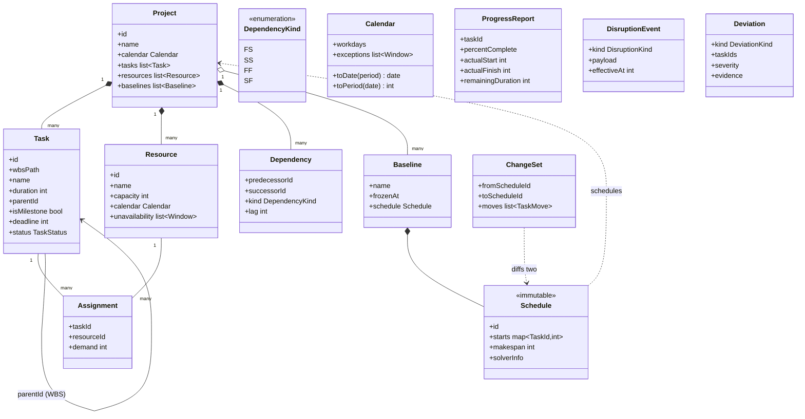

# 03 — Domain model

The domain model is the ubiquitous language of the system. Names below are normative — code, docs, and conversation use these words with these meanings.

## Core entities

## Semantics and invariants

Time is an integer working-period index (typically workdays) relative to the project start; `Calendar` owns all conversion to and from real dates, including resource-specific calendars. Durations are in working periods of the task's governing calendar. `deadline` is optional and expressed in periods.

Tasks form a WBS tree via `parentId`; only leaf tasks carry durations, assignments, and schedule dates — summary tasks derive their spans from children (HTN-style: summaries are decomposable tasks, leaves are primitive). `wbsPath` (e.g. `1.3.2`) is display metadata derived from the tree, never an identity.

Dependencies connect leaf tasks (v1; summary-level dependencies are expanded to leaves at validation time). All four kinds with integer lag are supported from the start because construction schedules use SS+lag pervasively (e.g., "start drywall 2 days after framing starts").

Resources are renewable with integer capacity per period (a crew of 4, 2 cranes). An `Assignment` demands integer units for the task's full duration (v1 simplification; time-varying demand is out of scope). Resource `unavailability` windows model breakdowns, inspector absence, and weather shutdowns uniformly.

`Schedule` maps every unstarted leaf task to a start period. It is immutable and identified; `Baseline` is a schedule with a name and a freeze timestamp. Completed and in-progress tasks are pinned by their actuals — a repair may never move the past (see design rule 3 in `CLAUDE.md` and `04-replanning-design.md` on the frozen zone).

`Deviation.kind` enumerates: `START_SLIP`, `FINISH_SLIP`, `DURATION_GROWTH`, `RESOURCE_CONFLICT`, `PRECEDENCE_VIOLATION`, `DEADLINE_JEOPARDY`, `INVALID_PLAN`. Severity is derived (e.g., float consumed / float available), not hand-assigned.

## Validation rules (enforced by pydantic + a `validate_project` pass)

The dependency graph restricted to leaves is acyclic. Every `Assignment` references existing task and resource ids, with `0 < demand <= capacity`. Milestones have zero duration. A `ProgressReport` may not set `actualFinish` before `actualStart`, nor report on a summary task. Any violation is an error at the io/proposal boundary — invalid states are unrepresentable inside the core.

## Persistence

v1 persists a project directory: `project.json` (the entities above, versioned schema), `schedules/` (immutable schedule JSONs), `events.jsonl` (append-only progress and disruption log). SQLite arrives when querying needs outgrow files; the domain model must not assume either.
