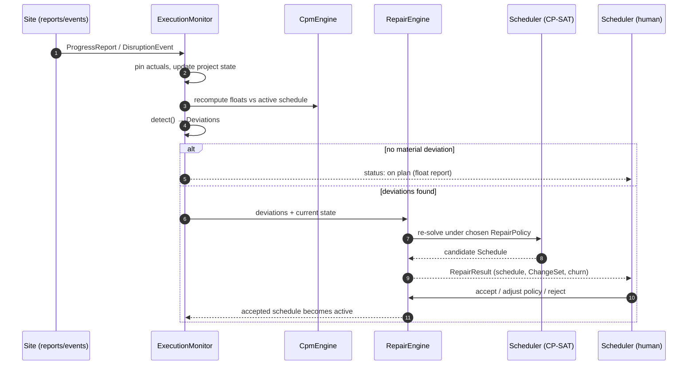

# 04 — Replanning design

This is the heart of the system. Everything else exists so this loop can run.

## The loop

Two things are deliberate here. First, the human stays in the loop at acceptance — the tool proposes, quantifies, and explains; the scheduler commits. Second, the monitor runs the cheap CPM float computation on every update, and the expensive solver only when a deviation warrants it. `DEADLINE_JEOPARDY` (float being consumed faster than schedule progress) can trigger a *proactive* repair before anything is formally violated.

## State pinning and the frozen zone

Before any repair: completed tasks are fixed at their actuals; in-progress tasks are fixed at `actualStart`, with `remainingDuration` replacing the original estimate and the remainder scheduled from `resumeAt >= dataDate`; `dataDate` is a hard lower bound on every unstarted task. Additionally, a **commitment horizon** H (default 5 working days, configurable) protects unstarted tasks scheduled within H of now — crews have been called, deliveries booked. The frozen zone is the practical acknowledgment that near-term plan stability has real monetary value.

The frozen zone is **soft, not hard**. Freezing near-term starts as constraints is the obvious design and it fails on the most ordinary case in construction: a predecessor slips into a frozen successor's window, the frozen set becomes unsatisfiable, and CP-SAT returns bare INFEASIBLE — no schedule, no explanation, nothing the scheduler can act on. Instead, a frozen task's start carries a steep penalty for moving rather than a prohibition, so a repair always returns a schedule and *reports what it had to break*.

This collapses a special case. The `STABLE_RESOLVE` churn weights wᵢ already rise as tasks get nearer; the frozen zone is simply where that curve becomes steep, not a separate partition of tasks. H parameterises the weight function instead of drawing a boundary, and the old "unless they are directly involved in a deviation" exemption disappears entirely — the penalty handles it without anyone enumerating which tasks are implicated.

Genuine hard commitments still exist: a crane on a booked date, a concrete pour with a delivery that cannot move. `Task.hardCommitment` marks them, pinning the task at its start in the active schedule. Because they can genuinely conflict, they are the first rung of a ladder rather than an absolute.

## The relaxation ladder

Repairs relax in a fixed order, and every relaxation is reported:

**Tier 0 — facts.** Actuals of completed and in-progress work, and `dataDate` as a lower bound. Never relaxed, because they are not decisions. If Tier 0 alone is unsatisfiable, the *project data* is self-contradictory — a deadline already past, a cycle introduced by a scope change — and the correct output is an `INVALID_PLAN` deviation naming the conflicting facts, not a repair.

**Tier 1 — hard commitments.** Relaxed one at a time, latest first, so the nearest commitments survive longest. Each one broken is recorded.

**Tier 2 — the makespan bound M.** Relaxed to whatever the remaining constraints permit.

**Tier 3 — soft churn**, including the frozen-zone weights. Never binding; it only ranks solutions.

The invariant that matters: **a repair never returns bare INFEASIBLE.** It returns a schedule together with the tier it had to reach, or an `INVALID_PLAN` explaining which Tier 0 facts collide. A solver result the human cannot act on is a bug, not an answer.

Pinning is per *endpoint*, not per task, which is what `ScheduleEntry.state` encodes (see `03-domain-model.md`). A completed task is pinned at both ends. An in-progress task is a pinned prefix plus a schedulable remainder: its `start` is a fact and never moves or contributes churn, while its `resumeAt` and `finish` remain decisions the repair may change. Only that split makes the common case tractable at hourly resolution, where a task begun late on a Friday routinely carries its remainder across a weekend and may be diverted before it resumes.

All progress arithmetic happens in working-tick space via the calendar's prefix function `W` (ADR-8), never in elapsed ticks. Expected work done by tick `t` is `clamp(W(t) − W(actualStart), 0, duration)`. A task idle across non-working time therefore accrues no variance, and the monitor stays silent when reality is behaving.

## Materiality

Hourly resolution makes deviation detection noisy in a way daily resolution hid: an hour of slip on a six-month project is not news, but it is a non-zero difference, and a monitor that reports every one of them is a monitor nobody reads. Detection thresholds are therefore **configurable and relative, never absolute ticks**. A deviation is material when the slip exceeds a fraction of the affected task's own duration, or consumes more than a configured fraction of its total float, or crosses a deadline — whichever fires first. `DEADLINE_JEOPARDY` compares the *rate* of float consumption against the rate of progress, which is naturally scale-free and needs no threshold tuning. Thresholds are project settings with documented defaults, and every `Deviation` records the threshold it cleared in its `evidence`, so that a status report can always answer why something was or was not flagged.

## Repair policies

**RIGHT_SHIFT.** Pure propagation: push affected tasks later along dependency and resource-availability constraints, changing nothing else. No solver call (it's a topological sweep). Fast, maximally stable, and frequently wasteful — it's the naive answer whose cost the other policies are measured against.

**STABLE_RESOLVE** (the default). A CP-SAT re-solve over all unstarted tasks — including those inside the commitment horizon, which enter the model carrying steep churn weights rather than being held out of it — with a lexicographic or weighted objective:

1. minimize makespan overrun beyond a bound M (default: the pre-disruption makespan, softly relaxed);
2. minimize churn = Σᵢ wᵢ·|startᵢ − start⁰ᵢ| over tasks with a previous scheduled start, where near-term tasks get higher weights wᵢ (moving next week hurts more than moving month 4);
3. tiebreak: minimize count of moved tasks.

The weighting means the solver *prefers* the drainage-into-the-gap style resequencing (absorb the delay by exploiting idle capacity) over wholesale shifting, and prefers disturbing the distant future over the near future.

**FULL_RESOLVE.** Ignore the previous schedule entirely; optimize makespan (or the active objective) from current state. Maximum optimality, maximum churn. Appropriate at major scope changes or phase boundaries, and useful as the yardstick: the gap between STABLE_RESOLVE's and FULL_RESOLVE's makespans is the measured *price of stability*, reported to the user.

## Churn metrics (contract)

Every `RepairResult.churn` carries: `makespan_delta` (the difference in `projectFinish` ticks, so the measure never depends on a drifting origin), `tasks_moved`, `total_displacement` (Σ|Δstart| over movable tasks), `near_term_moves` (moves within 2·H), `critical_path_changed` (bool), and `price_of_stability` (STABLE vs FULL makespan gap, when both were computed). These are the numbers the human uses to choose; they are also the numbers the eventual LLM narrator explains.

Churn is measured on **starts** deliberately: "when do I show up" is what actually disrupts a subcontractor, and a metric that blended starts and finishes would be harder to reason about, not richer. But start-displacement alone loses real information — a task whose start is pinned and whose remaining duration grew has a moved finish and contributes zero to Σ|Δstart|. The accompanying `ChangeSet` therefore records both endpoints on every `TaskMove` (`deltaStart` and `deltaFinish`) alongside `added`, `removed`, and `durationChanges`. Metrics stay interpretable; the record stays complete.

`ChurnMetrics` also carries `commitments_broken` (a count), with the detail in `RepairResult.broken_commitments` — each naming the task, its committed start, its new start, and the tier that forced the break. Breaking a commitment costs real money on a site, so it is a headline number the scheduler sees at acceptance, never a log line.

`price_of_stability` requires solving the problem twice, once under STABLE_RESOLVE and once under FULL_RESOLVE. Against NFR2 that is a doubling of the time budget, so it is **opt-in per invocation** rather than always populated, and is `None` when only one policy was run.

## Deviation → default policy mapping

`PRECEDENCE_VIOLATION` / `INVALID_PLAN` → STABLE_RESOLVE (the plan is broken; repair minimally). `START_SLIP` / `FINISH_SLIP` / `DURATION_GROWTH` within float → no repair, monitor notes float consumption. Beyond float → STABLE_RESOLVE. `RESOURCE_CONFLICT` (a new calendar exception withdrawing capacity) → STABLE_RESOLVE. Scope additions or many simultaneous deviations (threshold: > 15% of remaining tasks affected) → recommend FULL_RESOLVE. The mapping is a default the user can override per invocation.

## Testing the loop

The repair invariants are crisp and must be property-tested: repaired schedules are feasible (checker returns no violations); every repaired schedule still contains exactly one entry per leaf task; actuals are unchanged, and no `COMPLETE` or `IN_PROGRESS` entry's `start` ever moves; a task inside the commitment horizon moves only when leaving it fixed would have made the repair infeasible, and every hard commitment that moved is reported in `broken_commitments` — the soft frozen zone is tested by *what it reports*, not by immovability; no `resumeAt` precedes `dataDate`; RIGHT_SHIFT never starts any task earlier than before; with a zero-impact disruption (slack absorbs it), STABLE_RESOLVE returns the original schedule with an empty ChangeSet; a ChangeSet round-trips, in that applying it to the `from` schedule reproduces the `to` schedule exactly, including added and removed tasks; and no repair ever returns bare INFEASIBLE — for any project whose Tier 0 facts are consistent, every policy returns a schedule, and every relaxation beyond Tier 0 appears in `broken_commitments`. Property-test the ladder directly by generating conflicts that force each tier in turn.

One invariant needs care rather than assertion. STABLE_RESOLVE churn ≤ FULL_RESOLVE churn with STABLE makespan ≥ FULL makespan is a statement about *optimal* solutions, and CP-SAT under a time limit returns feasible-but-suboptimal ones. Asserted naively it will flake on generated instances. Property-test it only where both solves proved optimality; elsewhere assert the weaker claim that each policy's result is within its reported optimality gap of the bound. A small library of scenario fixtures (the inspection-delay scenario from the design discussions is fixture #1) anchors regression tests with known-correct outcomes.
