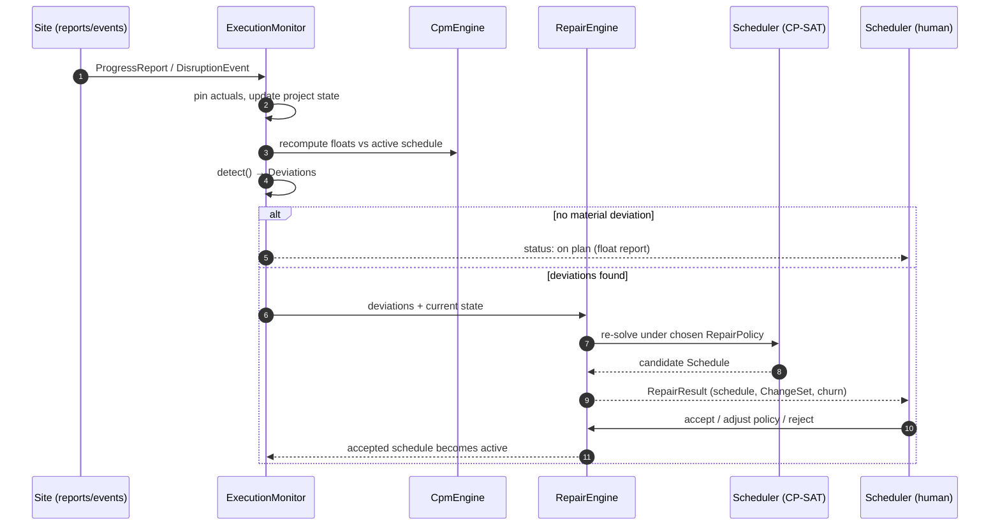

# 04 — Replanning design

This is the heart of the system. Everything else exists so this loop can run.

## The loop

Two things are deliberate here. First, the human stays in the loop at acceptance — the tool proposes, quantifies, and explains; the scheduler commits. Second, the monitor runs the cheap CPM float computation on every update, and the expensive solver only when a deviation warrants it. `DEADLINE_JEOPARDY` (float being consumed faster than schedule progress) can trigger a *proactive* repair before anything is formally violated.

## State pinning and the frozen zone

Before any repair: completed tasks are fixed at their actuals; in-progress tasks are fixed at `actualStart` with `remainingDuration` replacing the original estimate; "now" is a hard lower bound on every unstarted task. Additionally, a **commitment horizon** H (default 5 working days, configurable) freezes unstarted tasks scheduled within H of now unless they are directly involved in a deviation — crews have been called, deliveries booked. The frozen zone is the practical acknowledgment that near-term plan stability has real monetary value.

## Repair policies

**RIGHT_SHIFT.** Pure propagation: push affected tasks later along dependency and resource-availability constraints, changing nothing else. No solver call (it's a topological sweep). Fast, maximally stable, and frequently wasteful — it's the naive answer whose cost the other policies are measured against.

**STABLE_RESOLVE** (the default). A CP-SAT re-solve over unstarted, unfrozen tasks with a lexicographic or weighted objective:

1. minimize makespan overrun beyond a bound M (default: the pre-disruption makespan, softly relaxed);
2. minimize churn = Σᵢ wᵢ·|startᵢ − start⁰ᵢ| over tasks with a previous scheduled start, where near-term tasks get higher weights wᵢ (moving next week hurts more than moving month 4);
3. tiebreak: minimize count of moved tasks.

The weighting means the solver *prefers* the drainage-into-the-gap style resequencing (absorb the delay by exploiting idle capacity) over wholesale shifting, and prefers disturbing the distant future over the near future.

**FULL_RESOLVE.** Ignore the previous schedule entirely; optimize makespan (or the active objective) from current state. Maximum optimality, maximum churn. Appropriate at major scope changes or phase boundaries, and useful as the yardstick: the gap between STABLE_RESOLVE's and FULL_RESOLVE's makespans is the measured *price of stability*, reported to the user.

## Churn metrics (contract)

Every `RepairResult.churn` carries: `makespan_delta`, `tasks_moved`, `total_displacement` (Σ|Δstart|), `near_term_moves` (moves within 2·H), `critical_path_changed` (bool), and `price_of_stability` (STABLE vs FULL makespan gap, when both were computed). These are the numbers the human uses to choose; they are also the numbers the eventual LLM narrator explains.

## Deviation → default policy mapping

`PRECEDENCE_VIOLATION` / `INVALID_PLAN` → STABLE_RESOLVE (the plan is broken; repair minimally). `START_SLIP` / `FINISH_SLIP` / `DURATION_GROWTH` within float → no repair, monitor notes float consumption. Beyond float → STABLE_RESOLVE. `RESOURCE_CONFLICT` (new unavailability window) → STABLE_RESOLVE. Scope additions or many simultaneous deviations (threshold: > 15% of remaining tasks affected) → recommend FULL_RESOLVE. The mapping is a default the user can override per invocation.

## Testing the loop

The repair invariants are crisp and must be property-tested: repaired schedules are feasible (checker returns no violations); actuals and frozen-zone starts are unchanged; RIGHT_SHIFT never starts any task earlier than before; STABLE_RESOLVE churn ≤ FULL_RESOLVE churn while STABLE makespan ≥ FULL makespan; with a zero-impact disruption (slack absorbs it), STABLE_RESOLVE returns the original schedule with empty ChangeSet. A small library of scenario fixtures (the inspection-delay scenario from the design discussions is fixture #1) anchors regression tests with known-correct outcomes.
